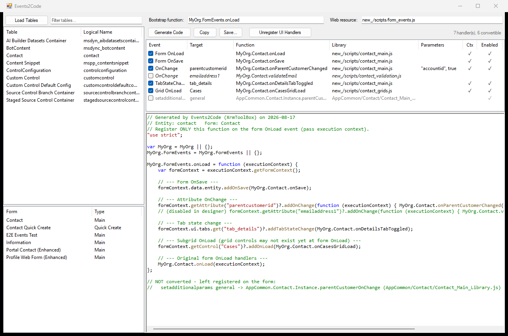

# Events2Code documentation

Events2Code is an [XrmToolBox](https://www.xrmtoolbox.com/) tool that turns event handlers
registered through the Dynamics 365 form designer into an equivalent JavaScript bootstrap
function, and then removes those registrations from the form.

| Page | What it covers |
|---|---|
| [Getting started](getting-started.md) | Installing the tool, connecting, and the full migration walkthrough |
| [Generated code](generated-code.md) | What the tool emits for each event kind, and the quirks it preserves |
| [What unregistering changes](form-changes.md) | The exact edits made to form XML, backups, and how to roll back |
| [Limitations and troubleshooting](troubleshooting.md) | What it will not convert, known gaps, and error messages |
| [Development](development.md) | Building, the UI harness, the live end-to-end suite, and releasing |

## The short version

Handlers registered in **Form Properties → Event Handlers** live in the form's XML. That makes
them invisible to source control, awkward to diff, and impossible to review alongside the code
they call. The Client API can register the same handlers at runtime — `addOnSave`,
`addOnChange`, `addTabStateChange`, `addOnLoad` — from a single OnLoad entry point.

Events2Code reads the form, writes that entry point for you, and strips the old registrations
once the code is in place.

*The tool reading a Contact main form: registered handlers on top, the generated bootstrap
below. Screenshots are taken from the real control via the [UI harness](development.md#ui-harness),
which is why there is no XrmToolBox chrome around it.*
