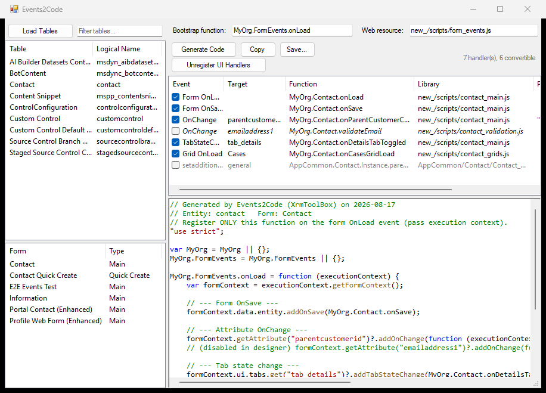

# Getting started

## Install

**From the XrmToolBox Tool Library** (once the package is listed): open XrmToolBox → *Tool
Library* → search for **Events2Code** → install → restart XrmToolBox.

**Manually:** download `Events2Code.dll` from the
[latest release](https://github.com/comentality/xrm-events-2-code/releases/latest), drop it into
your XrmToolBox `Plugins` folder, and restart XrmToolBox. The `Plugins` folder sits next to
`XrmToolBox.exe`, or under `%AppData%\MscrmTools\XrmToolBox\Plugins` for the installed build.

Requirements: XrmToolBox 1.2025.7 or newer, .NET Framework 4.8, and a Dataverse connection whose
user can read `systemform`, update it, and publish customizations (System Customizer is enough).

## The walkthrough

### 1. Pick a table and a form

Connect in XrmToolBox, open Events2Code, and press **Load Tables**. The filter box narrows the
list by display name or logical name. Selecting a table lists its **Main** and **Quick Create**
forms; selecting a form loads its XML and fills the handler grid.

If the form is managed, you get a warning first: unregistering handlers on it creates an
unmanaged customization on top of the managed form, which changes how future solution imports
behave.

### 2. Read the grid

Each row is one registration, with its event, target, function, library, extra parameters,
whether the execution context is passed (**Ctx**), and whether it is enabled.

| Row style | Meaning |
|---|---|
| Checked | Convertible and enabled — will be converted and removed |
| Unchecked, *italic* | Registered but disabled in the designer; converting it would resurrect dead code, so it starts unchecked |
| Grey, not checkable | Cannot be converted — internal Dynamics handlers, or events with no registration API. See [limitations](troubleshooting.md) |

Uncheck anything you want to leave on the form. The status line on the right counts what was
found and how much of it is convertible.

### 3. Name the bootstrap

**Bootstrap function** is the fully qualified name of the function to generate, e.g.
`MyOrg.FormEvents.onLoad`. Namespace objects along the path are declared for you.

**Web resource** is the name of the JavaScript web resource that function will live in, e.g.
`new_/scripts/form_events.js`. The tool does not create or upload that web resource — it only
needs the name so it can add it to the form's libraries when unregistering.

### 4. Generate

**Generate Code** builds the bootstrap from the checked rows and shows it in the preview pane.
**Copy** puts it on the clipboard; **Save...** writes it to a `.js` file. See
[generated code](generated-code.md) for what comes out and why.

### 5. Deploy the web resource — *before* the next step

Create or update the web resource named in step 3 with the generated code, and publish it.
Do this through the maker portal, a solution import, or whichever pipeline you normally use.

Order matters. If you unregister first, the form spends the gap with its old handlers gone and
no new ones in place.

### 6. Unregister

**Unregister UI Handlers** shows exactly what it is about to do and asks to confirm. On yes it:

1. Backs up the current form XML to `Documents\Events2Code\backups`
2. Removes the checked handlers from the form XML
3. Registers the bootstrap function on form OnLoad, with execution context passed
4. Adds the web resource to the form's libraries if it is not already there
5. Updates the form and publishes the table

Then it reloads the form, so the grid shows the new state: your bootstrap on OnLoad, plus
anything you left behind.

### 7. Verify

Open the form in the app, confirm the handlers still fire (browser console, or a breakpoint in
the bootstrap), and check *Form Properties → Event Handlers* now lists only the bootstrap.

If something is wrong, the backup from step 6 is the exact form XML from before the change —
[rolling back](form-changes.md#rolling-back) is a matter of writing it back to `formxml`.

## Docked narrow

The layout follows the window, so the tool is usable in a narrow XrmToolBox tab: the button row
wraps and the grid keeps its columns proportional.

